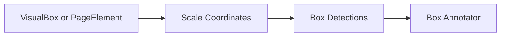

# Box Annotation

## Overview

This document describes how normalized boxes become visible rectangular
annotations.

Question this diagram answers: What must stay true for box annotation?

## Main Model

### Coordinate Contract

- Coordinates are `[x0, y0, x1, y1]`.
- Coordinates are normalized in the `0..1` range.
- Box order is strict: `x0 < x1` and `y0 < y1`.

### Label Behavior

- `VisualBox` labels become `class_name` detections.
- `PageElement` content does not create labels.
- Labeled detections are passed through the final label annotator.

## Rules

- Scale boxes against image width and height only inside runtime handlers.
- Keep page elements routed through the box slice.
- Keep e2e proof under `box_annotation`.
