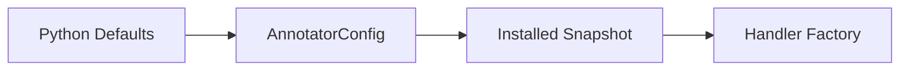

# Configuration And Validation

## Overview

This document describes how built-in defaults, public config, and validation
rules become a stable runtime snapshot.

Question this diagram answers: Where do defaults become runtime state?

## Main Model

### Defaults

- Defaults live in Python declarations, not shipped YAML.
- Comments beside constants preserve options and ranges from the old YAML config.
- Raw defaults are not re-exported from the top-level package.

### Validation

- Public DTOs validate coordinate, image, and video contracts at construction.
- `AnnotatorConfig` normalizes color names to `supervision.Color`.
- Runtime code consumes frozen config snapshots.

## Rules

- Do not ship package YAML config.
- Install config explicitly with `install_config(...)` when process defaults change.
- Keep validation limits in `_api/defaults.py`.
