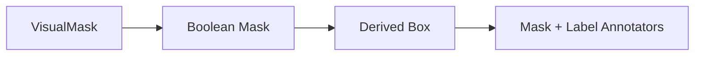

# Mask Annotation

## Overview

This document describes how binary masks become visible mask annotations with
labels.

Question this diagram answers: What does the mask slice derive before drawing?

## Main Model

### Mask Contract

- Masks are two-dimensional boolean grids.
- Empty masks produce a zero bounding box.
- Non-empty masks derive the smallest normalized bounding box around true cells.

### Label Behavior

- Mask labels become `class_name` detections.
- The final label pass uses the derived detection geometry.
- The caller does not need to submit a separate box for a mask.

## Rules

- Keep mask-to-box derivation private.
- Preserve width/height normalization order.
- Keep e2e proof under `mask_annotation`.
