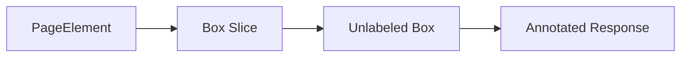

# Page Element Compatibility

## Overview

This document describes how document-page elements remain annotatable through
the same public package boundary as visual elements.

Question this diagram answers: How do page elements reuse visual annotation?

## Main Model

### Compatibility Shape

- Page elements carry a `coord` bounding box and `content` text.
- The content is preserved in the DTO but does not become a visual label.
- The response contract remains the same as other annotation calls.

### Verification Shape

- Public e2e coverage imports only `visual_annotation`.
- The scenario mirrors screenshot/quote-capture usage without importing old
  browser tooling.

## Rules

- Keep page elements public because upstream workflows pass them directly.
- Do not create a separate page-element runtime branch when box handling is enough.
- Keep e2e proof under `page_element_compatibility`.
