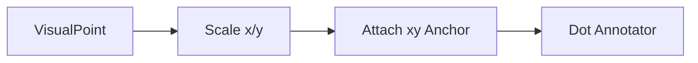

# Point Annotation

## Overview

This document describes how normalized points become visible dot annotations.

Question this diagram answers: What makes point detections different from box
detections?

## Main Model

### Point Contract

- Coordinates are `[x, y]`.
- Coordinates are normalized in the `0..1` range.
- Labels stay aligned with the point order supplied by the caller.

### Supervision Adaptation

- The detection still carries `xyxy` because supervision requires it.
- The dot annotator reads the dynamic `xy` anchor.
- The runtime owns this adaptation so callers do not need to know it exists.

## Rules

- Keep `xy` scaling paired with `xyxy` scaling.
- Do not expose supervision-specific point mechanics publicly.
- Keep e2e proof under `point_annotation`.
