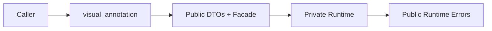

# Public Boundary And Errors

## Overview

This document describes the supported public entrypoint and how failures cross
that boundary.

Question this diagram answers: Which layer may callers rely on?

## Main Model

### Supported Imports

- Callers import from `visual_annotation`.
- `_api` organizes public declarations but is not a supported import path.
- `_internal` remains private.

### Error Translation

- DTO validation failures keep caller-facing validation context.
- Runtime drawing and handler failures become `AnnotatorError`.
- Handler mapping and config-domain failures use package-specific public errors.

## Rules

- Keep `__all__` only in the top-level package.
- Keep facades thin and delegate through the private root.
- Do not add compatibility modules for old public-looking paths.
