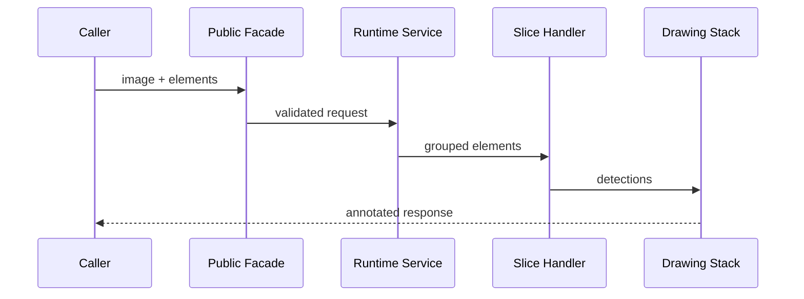

# Annotation Lifecycle

## Overview

This document describes the runtime flow for one public annotation request.

Question this diagram answers: What happens between `annotate(...)` and the
returned image?

## Main Flow

### Request Construction

- The public facade receives an image and iterable of elements.
- Public DTO construction validates image and element contracts.
- The facade delegates through the private root.

### Runtime Execution

- The service resolves the iterable into one trusted task.
- The annotator groups elements by concrete type.
- Each handler converts one group into supervision detections.

### Response

- Labeled detections receive a final label pass.
- The response carries the annotated image and `element_count`.

## Rules

- Keep public e2e scenarios shaped around this lifecycle.
- Keep runtime errors translated at the service boundary.
- Keep drawing dependencies private.
