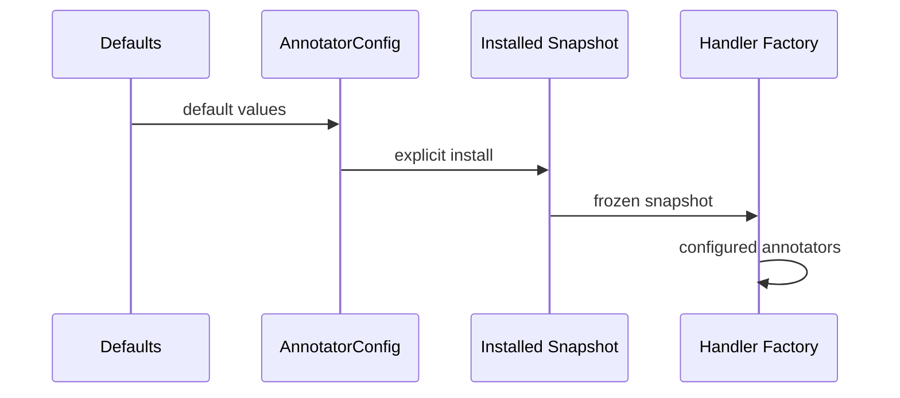

# Config Lifecycle

## Overview

This document describes how config defaults become handler runtime state.

Question this diagram answers: How does appearance config reach supervision?

## Main Flow

### Construction

- `AnnotatorConfig` starts from Python defaults.
- Color strings are normalized to `supervision.Color`.
- Numeric values are validated before the object is stored.

### Installation

- `install_config(...)` stores a frozen process snapshot.
- Installing config clears cached runtime services.
- Direct `annotate(..., config=...)` uses the supplied snapshot for one call.

## Rules

- Do not read mutable config state during handler execution.
- Keep config installation explicit.
- Keep old YAML ranges beside Python default constants.
