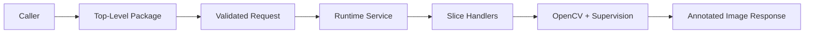

# System

## Overview

This document describes how visual annotation accepts a validated PIL image and
caller-provided visual elements, then returns an annotated image response. The
stable public boundary is the top-level `visual_annotation` package; private
runtime code owns handler selection, coordinate scaling, and supervision/OpenCV
adaptation.

Question this diagram answers: How does one public annotation request become an
annotated image?

## Public Runtime Model

Callers import `annotate`, DTOs, config, and public errors from
`visual_annotation`. Public DTOs validate image, box, point, mask, and page
element contracts at construction boundaries; runtime code receives those
validated snapshots. See [concepts/public-boundary-and-errors.md](concepts/public-boundary-and-errors.md)
for the boundary model.

## Execution Story

The public facade builds an annotation request and delegates into a private
service. The service resolves the element iterable once, creates or reuses a
configured runtime, groups elements by type, and dispatches each group to the
matching handler. See [flows/annotation-lifecycle.md](flows/annotation-lifecycle.md)
for the lifecycle.

## Runtime Shape

The durable behavior slices are box annotation, point annotation, mask
annotation, and page element compatibility. Each slice owns a public element
shape, a private detection conversion, and a matching e2e proof folder.
