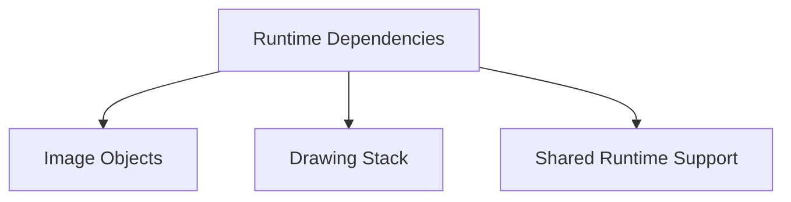

# Dependencies

## Overview

This document describes what the shipped dependency set supports and how the
main dependency groups differ.

Question this diagram answers: Which dependency groups support the runtime?

## Dependency Roles

### Image Objects

| Package  | Why it is shipped                                                           | Status                    |
| -------- | --------------------------------------------------------------------------- | ------------------------- |
| `pillow` | Provides the public image object accepted and returned by annotation calls. | Direct runtime dependency |

### Drawing Stack

| Package         | Why it is shipped                                                                     | Status                    |
| --------------- | ------------------------------------------------------------------------------------- | ------------------------- |
| `numpy`         | Converts images, boxes, points, and masks into array shapes consumed by drawing code. | Direct runtime dependency |
| `opencv-python` | Converts image channel order between PIL RGB and OpenCV BGR.                          | Direct runtime dependency |
| `supervision`   | Provides box, dot, mask, label annotators, and detection containers.                  | Direct runtime dependency |

### Runtime Support

| Package          | Why it is shipped                                                    | Status                    |
| ---------------- | -------------------------------------------------------------------- | ------------------------- |
| `py-lib-runtime` | Provides shared preview formatting and structured logging mechanics. | Direct runtime dependency |

## Rules

- Keep this doc limited to direct runtime dependencies.
- Remove a dependency when its runtime role disappears.
- Prefer Python defaults/config over YAML config dependencies.
