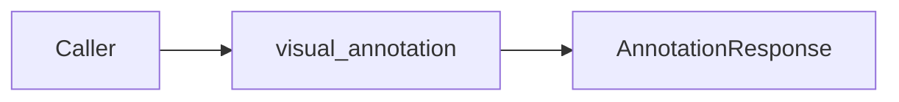

# Usage

## Overview

This document shows representative caller workflows for visual annotation.

Question this diagram answers: What public shape does application code use?



## Shapes

- `annotate(image, elements)`
  Annotates a PIL image with boxes, points, masks, or page elements.
- `AnnotatorConfig(...)`
  Builds a frozen appearance config for one call or process install.
- `install_config(config)`
  Installs a process-wide default config snapshot.

## Examples

## 1. Pattern: Annotate Boxes

Use when:
The caller has normalized bounding boxes and wants an annotated PIL image.

```python
from PIL import Image

from visual_annotation import VisualBox, annotate

image = Image.open("page.png").convert("RGB")
elements = [VisualBox(label="car", coord=[0.19, 0.54, 0.32, 0.72])]

response = annotate(image, elements)
response.response_data.save("annotated.png")
```

## 2. Pattern: Use A Custom Appearance Config

Use when:
The caller needs a one-off color or thickness without changing process defaults.

```python
from visual_annotation import AnnotatorConfig, VisualPoint, annotate

config = AnnotatorConfig(annotation_color="BLUE", point_radius=6)
response = annotate(
    image,
    [VisualPoint(label="target", coord=[0.5, 0.5])],
    config=config,
)
```

## 3. Pattern: Install Process Defaults

Use when:
The caller wants repeated annotation calls to share one config snapshot.

```python
from visual_annotation import AnnotatorConfig, install_config

install_config(AnnotatorConfig(annotation_color="GREEN"))
```
