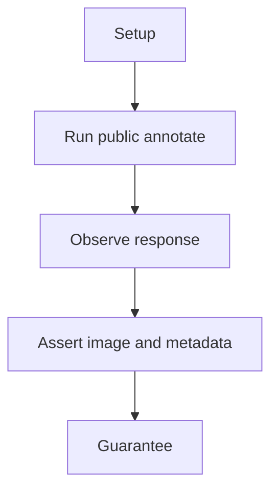
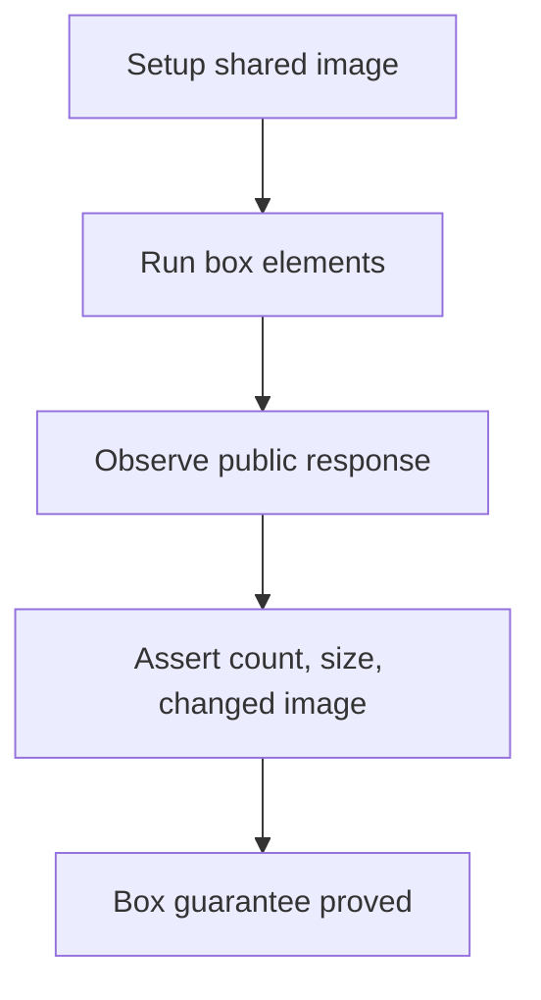

# Box Annotation E2E

## Overview

This document describes what the box annotation public scenario proves.

Question this diagram answers: What public guarantee does the box scenario prove?

## Proof Areas

## 1. Proof: Labeled Boxes Annotate Publicly

This proof area shows that labeled `VisualBox` objects are accepted through the
top-level package and produce an annotated response.

### Seen In Tests

[test_box_pipeline.py](../../../../tests/visual_annotation/e2e/box_annotation/test_box_pipeline.py)
proves boxes preserve response metadata, image size, and visible image changes.

Question this diagram answers: How does the test prove boxes annotate?

Walkthrough:

1. The scenario loads the shared image fixture.
2. It annotates two labeled boxes through top-level `annotate`.
3. It asserts `element_count`, output size, and image difference.

Why this is sufficient:

- The test uses only public imports.
- The output checks catch missing dispatch, scaling, or drawing.

Would fail if:

- Box elements no longer route to the box handler.
- The response stops reporting public metadata.
