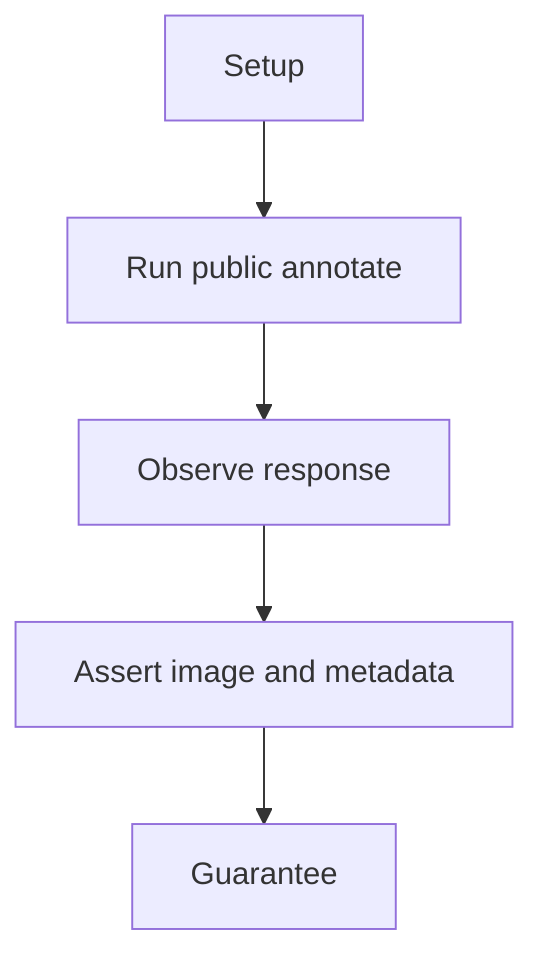
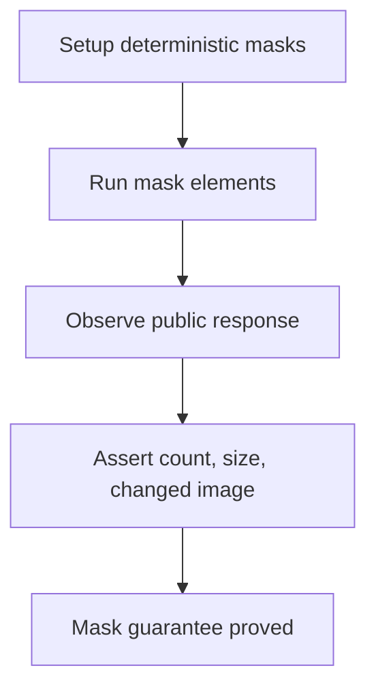

# Mask Annotation E2E

## Overview

This document describes what the mask annotation public scenario proves.

Question this diagram answers: What public guarantee does the mask scenario prove?

## Proof Areas

## 1. Proof: Labeled Masks Annotate Publicly

This proof area shows that labeled `VisualMask` objects are accepted through the
top-level package and produce an annotated response.

### Seen In Tests

[test_mask_pipeline.py](../../../../tests/visual_annotation/e2e/mask_annotation/test_mask_pipeline.py)
proves masks preserve response metadata, image size, and visible image changes.

Question this diagram answers: How does the test prove masks annotate?

Walkthrough:

1. The scenario derives deterministic masks from normalized boxes.
2. It annotates two labeled masks through top-level `annotate`.
3. It asserts `element_count`, output size, and image difference.

Why this is sufficient:

- The test proves the public mask DTO works end to end.
- The output checks catch missing mask drawing or response assembly.

Would fail if:

- Mask detections stop drawing.
- Mask response metadata drifts from the public contract.
