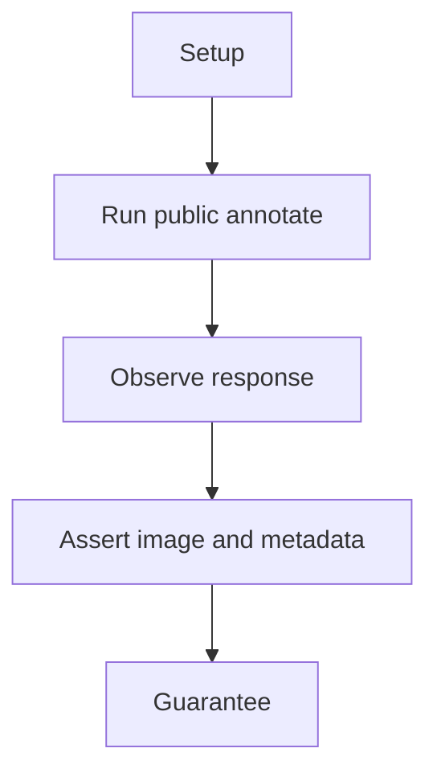
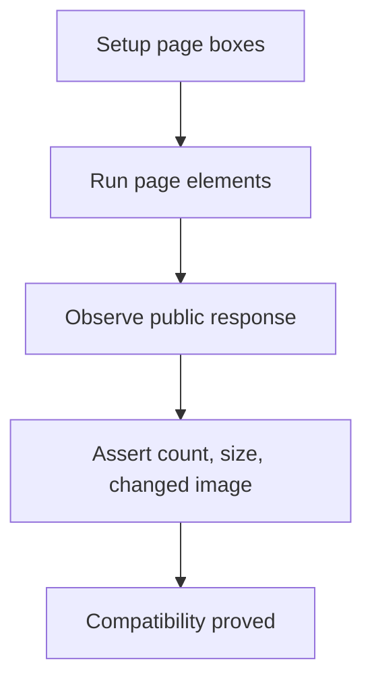

# Page Element Compatibility E2E

## Overview

This document describes what the page element compatibility scenario proves.

Question this diagram answers: What public guarantee does the page element
scenario prove?

## Proof Areas

## 1. Proof: Page Elements Annotate Publicly

This proof area shows that screenshot-style `PageElement` objects are accepted
through the top-level package and produce an annotated response.

### Seen In Tests

[test_page_element_pipeline.py](../../../../tests/visual_annotation/e2e/page_element_compatibility/test_page_element_pipeline.py)
proves page elements preserve response metadata, image size, and visible image
changes.

Question this diagram answers: How does the test prove page elements annotate?

Walkthrough:

1. The scenario loads page elements with content and box coordinates.
2. It annotates them through top-level `annotate`.
3. It asserts `element_count`, output size, and image difference.

Why this is sufficient:

- The test mirrors upstream screenshot/quote-capture usage.
- It proves compatibility without importing any old browser tool modules.

Would fail if:

- Page elements stop routing to box annotations.
- Public imports drift back to old private paths.
