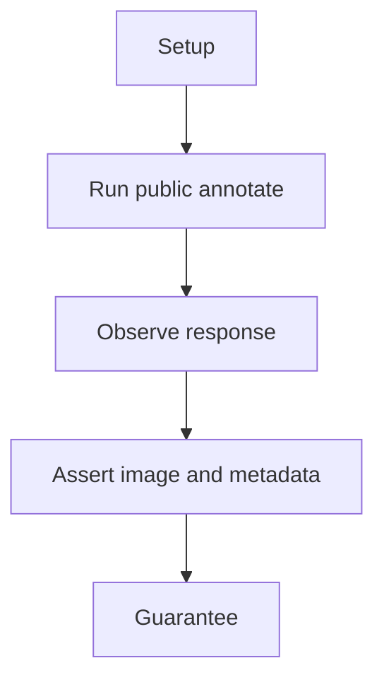
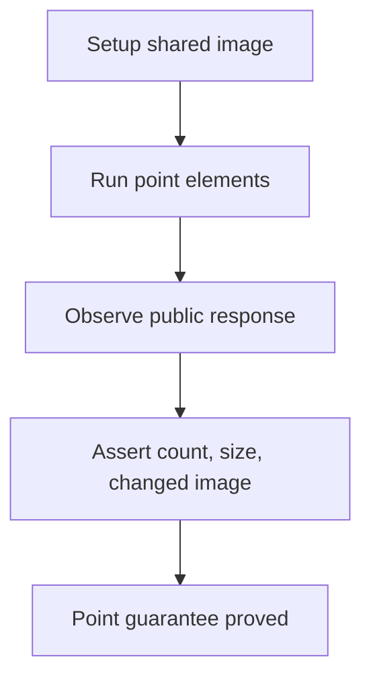

# Point Annotation E2E

## Overview

This document describes what the point annotation public scenario proves.

Question this diagram answers: What public guarantee does the point scenario prove?

## Proof Areas

## 1. Proof: Labeled Points Annotate Publicly

This proof area shows that labeled `VisualPoint` objects are accepted through
the top-level package and produce an annotated response.

### Seen In Tests

[test_point_pipeline.py](../../../../tests/visual_annotation/e2e/point_annotation/test_point_pipeline.py)
proves points preserve response metadata, image size, and visible image changes.

Question this diagram answers: How does the test prove points annotate?

Walkthrough:

1. The scenario loads the shared image fixture.
2. It annotates two labeled points through top-level `annotate`.
3. It asserts `element_count`, output size, and image difference.

Why this is sufficient:

- The test uses only public imports.
- The output checks catch missing point dispatch or drawing.

Would fail if:

- Point `xy` adaptation breaks.
- Labels or metadata stop flowing through the public response.
