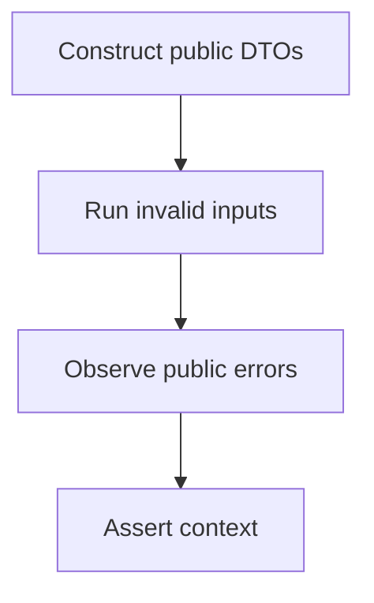
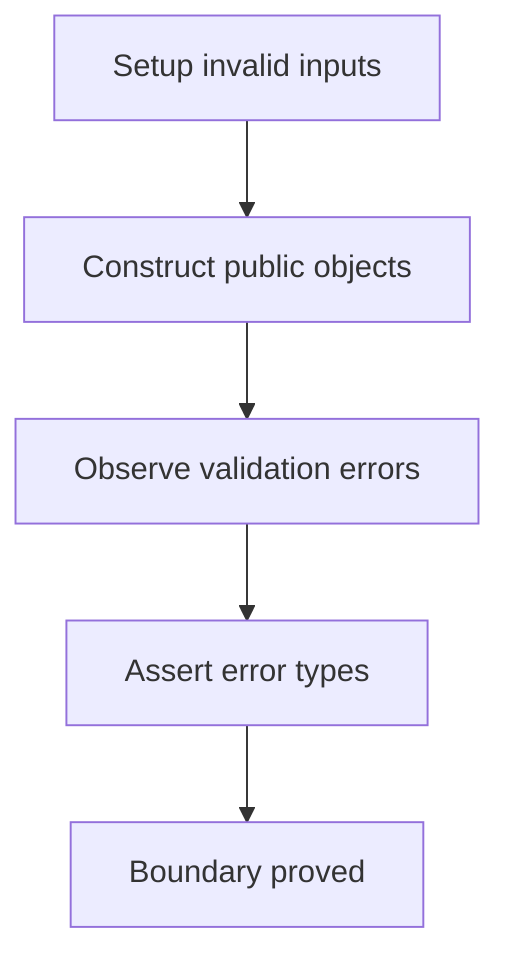
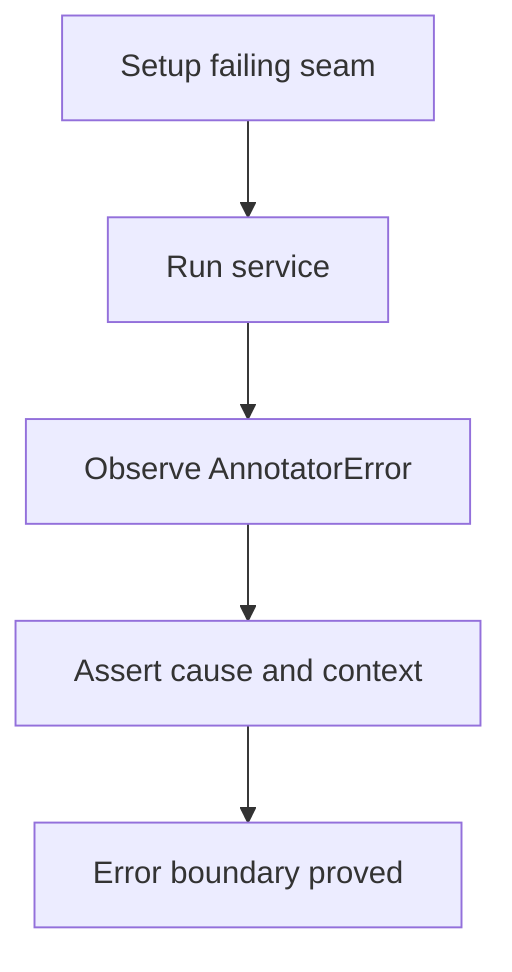

# Public Boundary And Errors Verification

## Overview

This document describes what the public boundary and error verification proves.

Question this diagram answers: Which failures are caught before runtime drift
reaches callers?

## 1. Proof: Public DTOs Validate Inputs

This proof area shows that boxes, points, images, videos, and config reject
invalid caller inputs with stable public errors or validation context.

### Seen In Tests

[test_public_config_and_types.py](../../../tests/visual_annotation/unit/test_public_config_and_types.py)
proves config normalization, coordinate validation, image limits, and video
selectors.

Question this diagram answers: How do public model tests prove caller contracts?

Walkthrough:

1. The tests construct public DTOs with invalid values.
2. They observe Pydantic or package-specific public errors.
3. They assert the specific validation context callers rely on.

Why this is sufficient:

- The tests target caller-facing object construction.
- The assertions catch accidental removal of old validation limits.

Would fail if:

- Validation moved out of construction boundaries.
- Public error context stopped carrying useful fields.

## 2. Proof: Service Errors Translate Runtime Failures

This proof area shows that unexpected runtime failures cross the service
boundary as `AnnotatorError`.

### Seen In Tests

[test_service_integration.py](../../../tests/visual_annotation/integration/test_service_integration.py)
proves resolver and annotator failures are translated with causes and context.

Question this diagram answers: How does the service proof catch error drift?

Walkthrough:

1. The tests inject controlled resolver and annotator failures.
2. The service catches unexpected lower-level exceptions.
3. The assertions verify cause preservation and element count context.

Why this is sufficient:

- The proof targets the private boundary where failures are translated.
- It catches accidental broad exception leakage.

Would fail if:

- The service stopped wrapping lower-level exceptions.
- Error context stopped including element counts.
