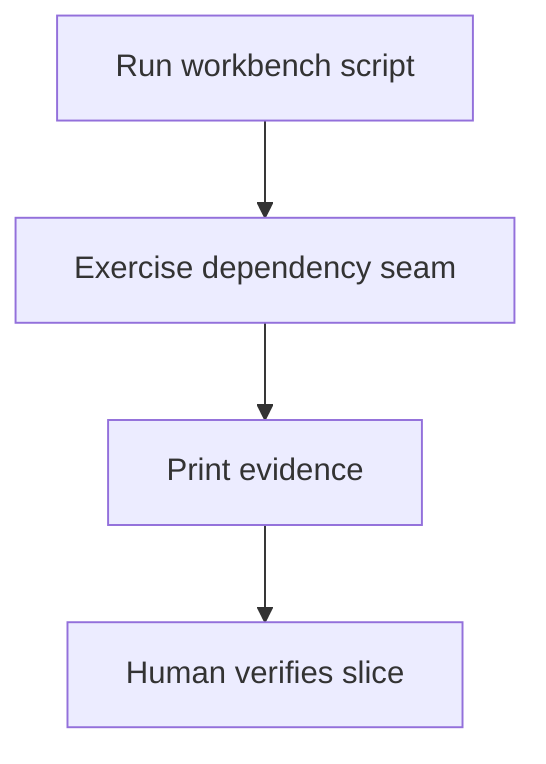
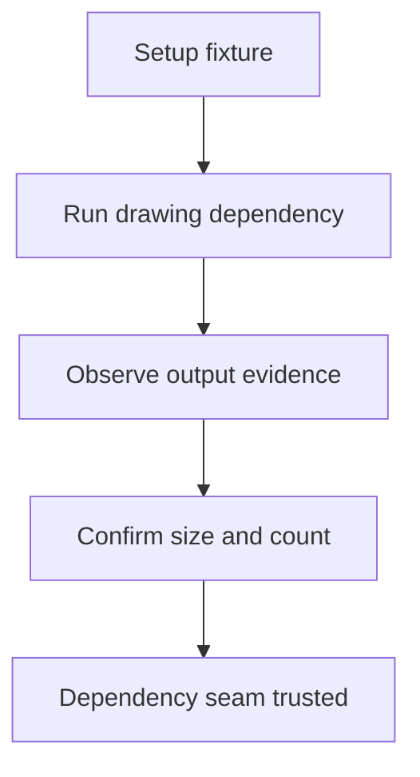

# Workbench Verification

## Overview

This document describes what the manual workbench probes prove. Workbench
scripts are live-first dependency checks and intentionally do not import the
shipped package.

Question this diagram answers: What do manual probes validate outside pytest?

## Proof Areas

## 1. Proof: Drawing Dependencies Work Locally

This proof area shows that the local OpenCV, PIL, NumPy, and supervision stack
can render each behavior slice against the shared image fixture.

### Seen In Scripts

[box_annotation.py](../../../workbench/visual_annotation/box_annotation.py)
proves box drawing dependencies work without package imports.

[point_annotation.py](../../../workbench/visual_annotation/point_annotation.py)
proves dot drawing and dynamic `xy` anchoring work without package imports.

[mask_annotation.py](../../../workbench/visual_annotation/mask_annotation.py)
proves mask drawing dependencies work without package imports.

[page_element_compatibility.py](../../../workbench/visual_annotation/page_element_compatibility.py)
proves page-box drawing works without label payloads.

Question this diagram answers: How does a workbench probe prove a dependency seam?

Walkthrough:

1. Each script loads the shared local image fixture.
2. Each script constructs the same geometry family as its e2e slice.
3. Each script prints small evidence with image size and element count.

Why this is sufficient:

- The scripts isolate dependency health from package implementation.
- The output is small enough to review manually.

Would fail if:

- The installed drawing dependencies changed incompatible APIs.
- The local fixture or geometry setup stopped matching e2e scenarios.
